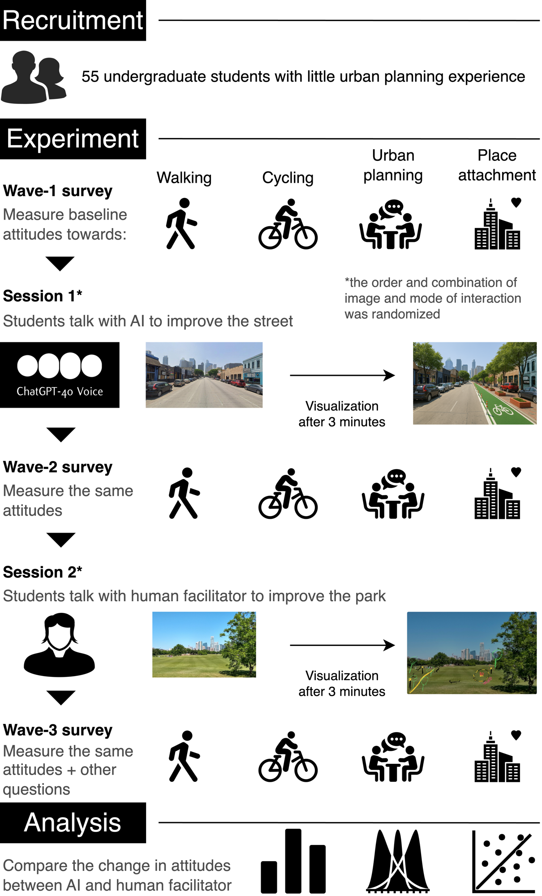

# Engaging Undergraduates with Urban Planning and Sustainable Mobility: GenAI vs. Human Co-creation

Reduced analysis dataset and R code for:

> Ito, K., Challa, S., Song, J., Gosling, S. D., Biljecki, F., & Kang, Y. (2026).
> Engaging undergraduates with urban planning and sustainable mobility: GenAI vs. human
> co-creation. *Journal of Geography in Higher Education*.
> https://doi.org/10.1080/03098265.2026.2733022

A free postprint is available at
https://ual.sg/publication/2026-jghe-genai/2026-jghe-genai.pdf.



This is the deposit named in the paper's Data Availability Statement: a reduced, de-identified
analysis dataset and the R code that produces the published results.

**Study.** A within-subjects experiment with 55 undergraduates at the University of Texas at Austin
(IRB STUDY00007102), comparing a GenAI agent against a facilitator-led discussion as ways of
introducing students to urban planning and sustainable mobility. Each participant did both, at two
Austin sites, with order and location counterbalanced. Four attitudinal outcomes were measured at
three waves.

---

## Contents and how to run it

```
data/processed/survey_processed.csv   the reduced dataset (55 x 140)
data/column_manifest.csv              disposition of all 180 source columns
genai_experiment/modeling/*.R         the analysis scripts
LICENSE                               MIT (code) and CC BY 4.0 (data)
CITATION.cff                          machine-readable citation
docs/figures/framework.png            the framework figure shown above
```

**The file at `data/processed/survey_processed.csv` is the reduced deposit dataset, not the
project's internal processed file.** It carries the name and path the scripts expect so that the
deposited code is *byte-identical* to the code that produced the published results — no path was
edited for packaging. The internal file it replaces has 180 columns; this one has 140, and what was
removed is listed below and enumerated in `data/column_manifest.csv`.

Run from the repository root, in numerical order:

```r
source("genai_experiment/modeling/3_ttest_analysis.R")
# ... through 12_primary_w1w2.R
```

`0_setup.R` installs and loads the required packages. Outputs are written to `reports/models/` and
`reports/figures/`.

### Scripts included

| Script | Produces |
|---|---|
| `0_setup.R` | Packages, output directories |
| `bootstrap_inference.R` | The shared bootstrap inference standard used by `4_` and `6_` |
| `theme_beautiful.R` | Plot theme |
| `3_ttest_analysis.R` | Paired and difference *t*-tests, mean-difference plot |
| `4_regression_analysis.R` | Bootstrap OLS models, VIF, the moderator table |
| `5_strength_weakness_effectiveness.R` | Strengths and limitations comparison |
| `6_change_in_interest.R` | Retrospective interest-change models |
| `7_future_suggestion.R` | Improvement suggestions, participation barriers |
| `9_effect_sizes.R` | Effect sizes |
| `10_carryover_analysis.R` | Carryover, position and wave-decomposition analyses |
| `11_lmm_analysis.R` | Linear mixed models (supplementary) |
| `12_primary_w1w2.R` | The primary W1→W2 estimand |
| `13_build_deposit_dataset.R` | **Documentation only — will not run here.** The script that built this deposit from the internal processed file, included so the reduction is auditable rather than asserted |

### Scripts deliberately not included

- `1_initial_balance_check.R` and `2_main_variable_construction.R` read the raw Qualtrics export,
  which is not deposited — it carries participant names, personal email addresses and university
  IDs. The participant characteristics they produce are reported in full in the paper.
- `8_sentiment_analysis.R` operates on the open-ended responses, which are withheld (below).

---

## Variable names: paper, code, and survey item

The paper and the code use different strings for the same regressors. The code names are the
originals and were deliberately left unchanged; the paper's labels were corrected during revision
because the originals misdescribed what was asked. This table is the map between them.

| Paper label | Code name | Survey item | Coding |
|---|---|---|---|
| Walking attitudes | `walk_wave_1/2/3` | "I support policies that encourage walking in Austin" | 5-point Likert, −2 to +2 |
| Cycling attitudes | `cycle_wave_1/2/3` | "I support policies that encourage cycling in Austin" | 5-point Likert, −2 to +2 |
| Planning participation | `plan_wave_1/2/3` | "I am willing to participate in urban planning processes" | 5-point Likert, −2 to +2 |
| Place attachment | `attach_wave_1/2/3` | "I feel a strong connection to Austin" | 5-point Likert, −2 to +2 |
| Planning Knowledge | `Planning_Knowledge_num` | `QID93` "Rate your knowledge of urban planning concepts." | Ordinal, 0–3 |
| **AI Familiarity** | `AI_Experience_num` | `QID94` "How familiar are you with artificial intelligence (AI) tools?" | Ordinal, 1–2 |
| **AI Image-Tool Use** | `AI_Tool_Usage_num` | `QID95` "Have you ever used AI image generation tools?" | Ordinal, 0–3 |
| GenAI First | `genai_first` | Whether the student experienced the GenAI method first | Binary |
| Street First | `street_first` | Whether the student experienced the street scenario first | Binary |

The two bolded rows are the ones most likely to mislead. `AI_Experience_num` is **not** about
generative AI — `QID94` asks about AI tools in general — and `AI_Tool_Usage_num` is specifically
about image generation tools. Change scores from wave 1 to wave 2 are `*_diff_1`.

---

## Provenance

| | |
|---|---|
| Source | the project's processed survey file (55 × 180), built from the raw Qualtrics export |
| Built by | `13_build_deposit_dataset.R`, included here |
| Reproducible | Deterministic given the source file (`set.seed(20260811)`) |
| Column-level record | `data/column_manifest.csv`, one row per source column |

The raw Qualtrics export is **not** deposited: it carries participant names, personal email
addresses and university IDs.

---

## What was removed, and why

`data/column_manifest.csv` gives the disposition of all 180 source columns. In summary:

**13 direct identifiers and session metadata.** `ResponseId`, `IPAddress`, `LocationLatitude`,
`LocationLongitude`, `StartDate`, `EndDate`, `RecordedDate`, `Duration (in seconds)`, the four
Qualtrics recipient fields, and `Status`.

`ResponseId` mattered most: it is a live join key to the identified survey export retained by the
research team, so publishing it would have re-identified every participant by lookup rather than by
inference. Its **values** are gone; its **column name** is reused for the pseudonymous key
(`p01`–`p55`, identical to `participant_id`), because three analysis scripts address the key by that
name. The manifest records this explicitly.

**8 page-timing paradata columns.** Per-page response latencies to the millisecond, distinct for
every participant.

**5 quasi-identifiers that no deposited script reads.** `College`, `Year_of_Study`,
`Year_of_Study_num`, `Housing_Location`, and `QID92` (prior planning participation). `College` was
the single strongest re-identification lever in the file — it has two categories containing one
participant each, and adding it to race × gender × hometown × year raises the count of unique
participants from 15 to 34. These are read only by the sample-description script, which is not part
of this deposit, so removing them costs no reproducibility at all.

**12 duplicate, empty or unread columns**, and **4 constants**.

**6 free-text columns emptied.** `QID152` (34 open-ended responses), `QID151`, and four "other,
please specify" fields. The column headers are kept so that scripts which check for them still run.
Participants' own words are recognisable to anyone who was present at their session, and 25 of the
34 open-ended responses have never been published. The nine quoted in the paper appear there and not
here.

Multi-select checkbox columns (`Traditional_Strengths`, `AI_Limitations.x`, `QID148`, `QID150`, …)
store fixed option labels rather than prose and are retained in full.

**Row order was randomised.** Rows in the source file are in chronological order, so the order alone
reconstructs the session schedule even once the timestamps are gone. `participant_id` is assigned
after the shuffle and carries no sequence information. This has a measurable cost, stated below.

---

## This file is not k-anonymous, and cannot be

Stated plainly, because the alternative would be to imply a protection that is not there.

The analysis fits models on race, gender, hometown, primary transportation and five behavioural
ordinals. Measured over the 55 rows:

| quasi-identifier set | participants unique (k = 1) |
|---|---|
| race × gender | 0 (0%) |
| + hometown | 7 (13%) |
| + primary transportation | 18 (33%) |
| **all covariates retained in this file** | **53 (96%)** |

On a 55-row file, keeping the covariates the published models require and achieving k-anonymity are
mutually exclusive. Coarsening the demographic categories does not resolve this — it moves the
number by a few participants. Only dropping the covariates outright would, and that would leave a
file that cannot reproduce the paper's regression tables.

The deposit therefore keeps the analysis intact and states the residual risk rather than obscuring
it. The judgement rests on four things:

1. **No direct identifiers and no join key.** Re-identification requires inference, not lookup.
2. **An attacker must already know the person.** They would have to know a specific individual's
   race, gender, hometown type, transport mode, walking and cycling frequency and self-rated
   planning knowledge — *and* know that person took part in the study.
3. **The content is low-sensitivity.** Attitudes toward walkability, cycling and public
   participation, plus non-clinical background variables. Race is the one special-category
   attribute; nothing here is stigmatising, and no coefficient estimated on it is interpreted in the
   paper.
4. **The frame is enumerable but large.** Undergraduates at one named university.

Users of this file must not attempt to re-identify participants.

---

## What this file reproduces

Verified by running every included script twice in identical sandboxes — once on the full processed
file, once on this reduced file — and comparing outputs column by column. All 18 runs completed
without error, and the full-file arm reproduced the project's own committed outputs exactly, so the
comparison below isolates the effect of the reduction and nothing else.

**Every point estimate is reproduced.** Across the 336 coefficients of the regression suite, the 88
rows of the primary W1→W2 analysis and the 64 rows of the interest models, the largest disagreement
in any estimate is **7.5 × 10⁻¹⁵** — floating-point noise from summing in a different row order.
Means, standard deviations, *t*, df, *p*-values and effect-size point estimates in the *t*-test,
effect-size and carryover suites likewise agree exactly. Of 311 numeric columns compared, 276 agree to within
10⁻⁵. The other 35 are all bootstrap quantities: interval endpoints, bootstrap standard errors,
dropout rates, and one significance flag derived from them. These figures were re-measured on the
final published code on 2026-09-19.

**Bootstrap interval endpoints do not reproduce exactly, and one consequence is visible.** The
bootstrap is seeded, but it resamples *rows*, so randomising the row order changes which cases are
drawn. Interval endpoints move by up to **0.363**, bootstrap standard errors and per-term dropout
rates by up to **0.032**. Because significance is defined as "the interval excludes zero", two
coefficients out of the 336 in the regression suite, and one covariate out of the 52 rows of the
carryover interaction models, therefore carry a different verdict here than in the paper's outputs:

| Model | Term | In the paper's outputs | Running this deposit |
|---|---|---|---|
| `attach_conv_model` | AI Familiarity (+0.612) | not significant | significant |
| `walk_park_model` | GenAI First (+0.688) | significant | not significant |
| carryover interaction, cycling, adjusted | Planning Knowledge (+0.137) | significant | not significant |

All three are knife-edge cases whose interval endpoint sits within about 0.03 of zero, and the
paper interprets none of them. The third is a control covariate that the paper's carryover table
does not print. No other verdict differs, and none of the paper's reported findings depends on
any of these coefficients. We record them here so that a reader who re-runs the code and sees a
discrepancy knows its cause and its extent.

The same mechanism moves interval endpoints in the carryover suite by at most 0.045. The
mixed-model suite agrees to within 10⁻⁵.

**Does not reproduce:**

- `8_sentiment_analysis.R` — the NRC/Bing sentiment analysis of open-ended responses. Its input is
  the free text withheld above. The sentiment figures in the paper cannot be regenerated from this
  deposit, and the script is not included.
- Word clouds over the "other, please specify" fields in `5_strength_weakness_effectiveness.R` (1–2
  responses each) and `7_future_suggestion.R`. Same reason. Both scripts otherwise run and produce
  every other output.

---

## Notes for re-use

- `ResponseId` holds the same value as `participant_id`. It is **not** the original Qualtrics
  identifier.
- Missing values are written as empty fields.
- Wave-level outcomes are `{walk,cycle,plan,attach}_wave_{1,2,3}`; wave 1 → wave 2 change scores are
  `{walk,cycle,plan,attach}_diff_1`.

## Licence

- **Code** (`genai_experiment/modeling/`): MIT. See `LICENSE`.
- **Data** (`data/`): Creative Commons Attribution 4.0 International (CC BY 4.0).

## Citation

Please cite the paper. If you use the dataset directly, please cite this deposit as well. A
machine-readable entry is in `CITATION.cff`.

```bibtex
@article{ito2026genai,
  title   = {Engaging Undergraduates with Urban Planning and Sustainable Mobility:
             GenAI vs. Human Co-creation},
  author  = {Ito, Koichi and Challa, Suhana and Song, Justin and Gosling, Samuel D. and
             Biljecki, Filip and Kang, Yuhao},
  journal = {Journal of Geography in Higher Education},
  year    = {2026},
  doi     = {10.1080/03098265.2026.2733022}
}
```
